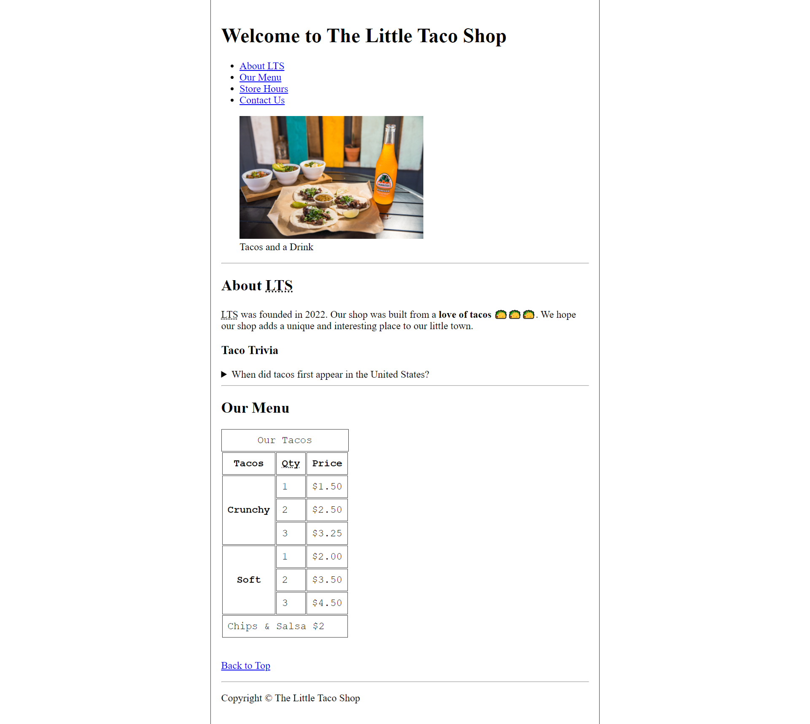
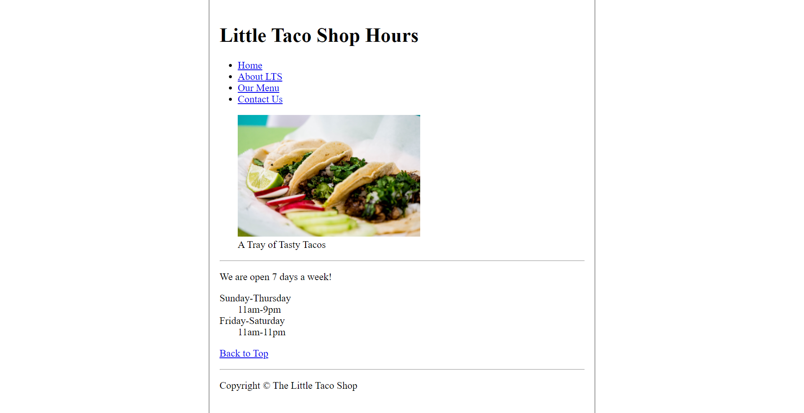
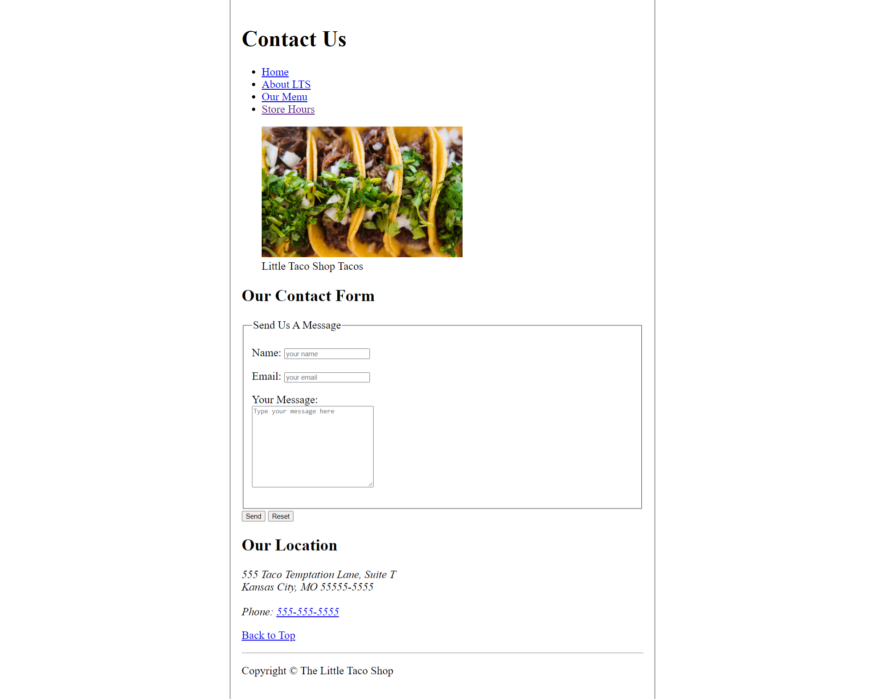

# 🌮 The Little Taco Shop

A static website built with **semantic HTML5** and **CSS**, created as a project to practice building accessible, well-structured, and standards-compliant web pages.

---

## 📸 Previews

| Home (`index.html`) | Store Hours (`hours.html`) | Contact Us (`contact.html`) |
| :---: | :---: | :---: |
|  |  |  |

---

## 🚀 Key Features

- **Semantic & Accessible HTML5**: Extensive use of semantic tags (`<header>`, `<nav>`, `<main>`, `<section>`, `<figure>`, `<figcaption>`, `<abbr>`, `<details>`, `<table>`, `<address>`, `<footer>`).
- **Multi-page and intra-page navigation**: Page linking and quick jumping via anchor links (`#about`, `#menu`, `#top`).
- **Structured Data Tables**: Price menu organized with accessible header scopes (`scope="col"`, `scope="row"`), merged cells (`rowspan`, `colspan`), `thead`, `tbody`, and `tfoot`.
- **Functional Contact Form**: Accessible form with `<fieldset>`, `<legend>`, `<label>` tags linked to inputs and textarea, plus submit and reset buttons.
- **Clean Centered Design**: CSS styles in `css/style.css` featuring a centered layout and custom table styling.
- **Image Optimization**: Attributes such as `width`, `height`, and `loading="lazy"` for enhanced rendering and performance.

---

## 📂 Project Structure

```text
the_little_taco_shop/
├── css/
│   └── style.css            # Main stylesheet
├── examples/                # Reference screenshots
│   ├── contact-example.png
│   ├── home-example.png
│   └── hours-example.png
├── img/                     # Graphic assets
│   ├── tacos_and_drink_400x267.png
│   ├── tacos_close_up_400x260.png
│   └── tacos_tray_400x267.png
├── contact.html             # Contact page and message form
├── favicon.ico              # Browser tab icon
├── hours.html               # Business hours
├── index.html               # Main page (About & Menu)
└── README.md                # Project documentation
```

---

## 🛠️ Technologies Used

- **HTML5**: Semantic markup and modern web standards.
- **CSS3**: Typography, layout, and table styling.

---

## 💻 How to View / Run the Project

1. **Clone the repository** (or download the files):
   ```bash
   git clone https://github.com/LuisLebus/the_little_taco_shop.git
   cd the_little_taco_shop
   ```

2. **Open in your browser**:
   - Double-click on `index.html` to open it directly in any web browser.
   - Or use extensions like **Live Server** in VS Code / your favorite IDE.
   - Or start a lightweight local HTTP server using Python:
     ```bash
     python3 -m http.server 8000
     ```
     Then navigate to `http://localhost:8000` in your browser.

---

## 👤 Author

- **Luis Lebus**
